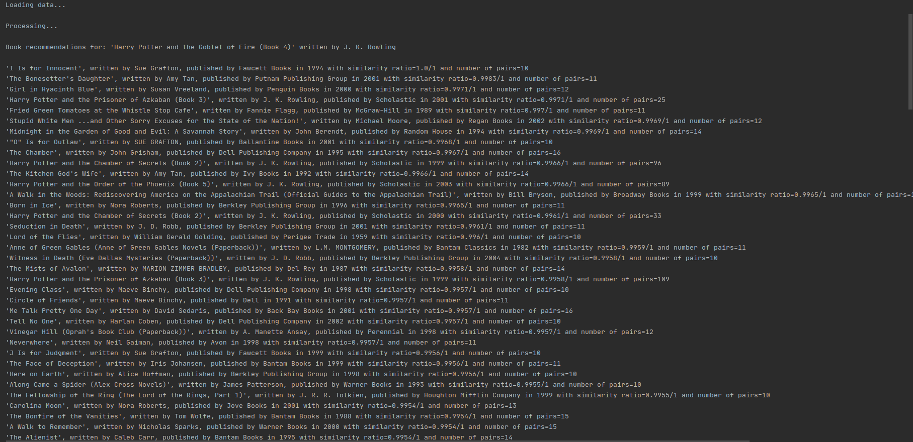

# Big data analytics with [Apache Spark][sparklink]

## Video Game Sales
Data source: https://www.kaggle.com/gregorut/videogamesales

Set contains over 16 thousand rows. 
#### Solved problems:
- Established most profitable year of the game industry, in the years
   1980-2016, based on sales around the world.
- Found most popular game of mentioned above year.
###
- Determining which genres were most popular/profitable in which region (+ split by platform).
- Analysis presenting which genre and in which region was the most popular/profitable on particular platform.
###
- Trying to predict global sales result based on: 
  - production year
  - the platform on which the game was released (PS4/Wii/...)
  - genre (Shooter/Sports/...)
  - publisher (Activision/SquareSoft/...)
  
Result:
After testing multiple regression types,
we can assume there are no strong connotations
###
## Book recommendations
Data source: https://www.kaggle.com/ruchi798/bookcrossing-dataset

Recommendation analysis based on 1.15 million book ratings.
###
As an input, you need to enter the id of the book. The system returns the books 
that were rated by other users who also rated book, you are interested in. 
The system takes only positive ratings, the limit value can be set 
according to your preferences. By default, 
we consider ratings, which are better than 3 out of 10.
Because of uneven distribution of the reference data (most of the
 ratings are 0), I decided to transform every 0 rating to random value.
 
 ###
 There is an option to declare the age range of the users in order 
 to better adjust the results. 
 
 ###
You are able to determine low limit of the similarity factor 
(calculated on the basis of ratings) as well as number of particular 
pairs occurrences. By default, we take under consideration pairs with 
number of occurrences equal or greater than 10. 
The recommendations are sorted by the similarity factor in descending order.
###

[sparklink]:https://spark.apache.org/
